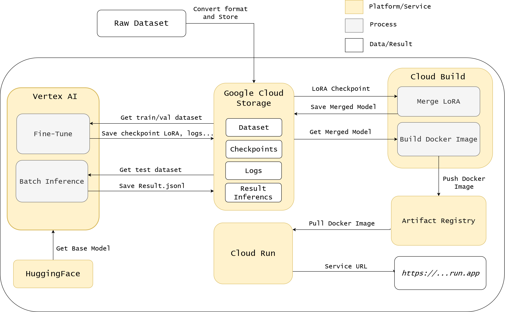

# Fine-Tuning and Deploying a Vision LLM for Electricity Bill to JSON Conversion on Google Cloud

This project fine-tunes a Vision LLM (Qwen2.5-VL) to convert electricity bill documents (PDFs/images) into structured JSON, and deploys it as a GPU-backed, scale-to-zero endpoint on Google Cloud. It is ported from an original Amazon SageMaker implementation to **Vertex AI** (training, batch inference) and **Cloud Run** (serving), using the [SWIFT framework](https://github.com/modelscope/ms-swift) for fine-tuning.

| Model | Task | Served name | Cloud Run service |
|---|---|---|---|
| `document-to-json` | Electricity bill extraction | `document-to-json` | `vllm-serve-bill` |




## Platforms Used
 
The diagram above uses three visual groups: yellow = platform/service (where things run or are stored long-term), gray = process/job (a task executed inside a platform), white = data/result (an artifact produced or consumed at a point in time).
 
| Platform | Role in this pipeline | Link |
|---|---|---|
| [Hugging Face](https://huggingface.co) | Hosts the base model (`Qwen/Qwen2.5-VL-3B-Instruct`), pulled at the start of fine-tuning | https://huggingface.co |
| [Cloud Storage (GCS)](https://cloud.google.com/storage) | Stores raw/synthetic dataset, LoRA checkpoints, logs, batch inference results, and the merged model | https://cloud.google.com/storage |
| [Vertex AI](https://cloud.google.com/vertex-ai) | Runs fine-tuning and batch inference as managed GPU jobs that shut down automatically when done | https://cloud.google.com/vertex-ai |
| [Cloud Build](https://cloud.google.com/build) | Runs two one-off jobs: merge the LoRA checkpoint into the base model, and bake the merged model into a Docker image | https://cloud.google.com/build |
| [Artifact Registry](https://cloud.google.com/artifact-registry) | Stores the built Docker image (layer-cached), separate from GCS since Cloud Run needs the Docker Registry API, not a blob store | https://cloud.google.com/artifact-registry |
| [Cloud Run](https://cloud.google.com/run) | Pulls the image from Artifact Registry and serves it as a GPU-backed, scale-to-zero endpoint | https://cloud.google.com/run |
 
## Key Features

- **End-to-End Document Processing**: raw image/PDF to structured JSON output
- **Vertex AI Training**: fine-tuning runs as a Vertex AI Custom Job (A100/L4 GPU)
- **Vertex AI Batch Inference**: large-scale inference on held-out data via Vertex AI Custom Job
- **JSON Constrained Decoding**: uses [structured outputs in vLLM](https://docs.vllm.ai/en/latest/features/structured_outputs.html) to guarantee valid JSON
- **Cloud Run GPU Serving**: scale-to-zero endpoint (1x NVIDIA L4), no cost while idle
- **Baked-Model Image**: the merged model is baked directly into the Docker image at build time, so cold start loads it from local disk instead of downloading from GCS

## Pipeline Overview

```
GCS (raw dataset)
   └─ 02_create_custom_dataset_swift.ipynb → Swift-format dataset on GCS
        └─ 03_finetune_swift.ipynb → Vertex AI Custom Job (A100/L4) → LoRA checkpoint on GCS
             ├─ 04_run_batch_inference.ipynb → Vertex AI Custom Job → results.jsonl on GCS
             │      └─ 05_evaluate_model.ipynb → metrics, heatmaps, comparison tables
             └─ 06_deploy_pipeline_bill.ipynb
                    ├─ Cloud Build: merge LoRA into base model → merged model on GCS
                    ├─ Cloud Build: bake merged model into Docker image → Artifact Registry
                    └─ Cloud Run: deploy GPU service (--min-instances 0)
                           └─ 07_consume_model_cloudrun.ipynb → call the deployed endpoint
```

## Implementation Workflow

1. **Dataset conversion to Hugging Face format** (optional): `01_optional_convert_fatura2_to_hf_dataset.ipynb`
2. **Creation of Swift-compatible training data**: [02_create_custom_dataset_swift.ipynb](02_create_custom_dataset_swift.ipynb)
3. **Model fine-tuning on Vertex AI**: [03_finetune_swift.ipynb](03_finetune_swift.ipynb)
4. **Batch inference on Vertex AI**: [04_run_batch_inference.ipynb](04_run_batch_inference.ipynb)
5. **Model evaluation**: [05_evaluate_model.ipynb](05_evaluate_model.ipynb)
6. **Deployment (merge → build → deploy)**: [06_deploy_pipeline_bill.ipynb](06_deploy_pipeline_bill.ipynb)
7. **Consume the Cloud Run endpoint**: [07_consume_model_cloudrun.ipynb](07_consume_model_cloudrun.ipynb)

## Prerequisites

* A Python 3.11 or 3.12 environment with Jupyter (tested on Vertex AI Workbench and Cloud Shell).
* A GCP project with billing enabled and the following APIs turned on: Vertex AI, Cloud Build, Cloud Run, Artifact Registry, Cloud Storage.
* `gcloud` CLI installed and authenticated, or run everything from **Cloud Shell** — commands are written for a Linux shell; running `gcloud` from PowerShell on Windows breaks flags like `--set-env-vars`/`--startup-probe` because of different quoting rules.
* GPU quota in the target region: A100 or L4 for training/batch inference (Vertex AI), and L4 for serving (Cloud Run).
* A GCS bucket for the dataset (see `01_gcs_config.json` for the config format).

## Configuration

All GCS paths, project ID, and region live in `01_gcs_config.json` and are read by the notebooks — nothing is hardcoded across cells:

```json
{
  "project_id": "first-orc-chien",
  "bucket_name": "electric-bill-dataset-gcs",
  "region": "asia-southeast1",
  "gcs_output_prefix": "data/swift_dataset",
  "gcs_model_dir": "output/model"
}
```

## Training on Vertex AI

Fine-tuning runs as a **Vertex AI Custom Job**, not a local process. Available machine types:

| Machine Type | GPU | VRAM | Model | Note |
|---|---|---|---|---|
| a2-highgpu-1g | A100 40GB | 40GB | Qwen2.5-VL-7B | Recommended |
| a2-highgpu-2g | 2x A100 40GB | 80GB | Qwen2.5-VL-7B | Larger batch size |
| g2-standard-8 | L4 24GB | 24GB | Qwen2.5-VL-3B | Smaller model |

The job uploads the training script to GCS, spins up the instance, runs Swift fine-tuning, saves the LoRA checkpoint back to GCS, and shuts the instance down automatically.

## Deployment: Merge → Bake → Serve

Deployment does not use a SageMaker endpoint or a long-running VM. It is three Cloud Build/Cloud Run steps:

1. **Merge**: a Cloud Build job merges the LoRA checkpoint into the base model and uploads the merged weights to GCS.
2. **Bake**: a Cloud Build job downloads the merged model from GCS (in a step that has Cloud Build credentials — `RUN gsutil` inside the Dockerfile itself has none) and bakes it into a Docker image (`inference-bill`).
3. **Deploy**: the image is deployed to Cloud Run with 1x NVIDIA L4 GPU, 8 vCPU, 32GB memory, and `--min-instances 0`, so the service scales to zero and costs nothing while idle.

Because the model is baked into the image, cold start loads it from local disk instead of downloading from GCS — this is the main latency win over downloading at container startup. Rebuilding the image is only required when the model or `Dockerfile`/`entrypoint.sh` changes.

## Evaluation

`05_evaluate_model.ipynb` reports:

- Field-level Exact Match and Character Error Rate (CER)
- ROUGE metrics for free-text fields
- Edit-distance heatmaps per entity
- Side-by-side comparison across model versions


### Model Comparison

|    | model | pretty_name | rouge1 | rouge2 | rougeL | rougeLsum | model_name | accuracy (exact match) | cer_score |
|---:|---|---|---:|---:|---:|---:|---|---:|---:|
|    |   |   |   |   |   |   |   |   |   |

## Notebooks and Structure

### Notebook 02: [`02_create_custom_dataset_swift.ipynb`](02_create_custom_dataset_swift.ipynb)
**Creating Swift-Compatible Training Dataset**
- Handles multi-page PDF/image inputs
- Normalizes bounding box coordinates
- Integrates with GCS for cloud storage
- Generates training-ready JSONL files

### Notebook 03: [`03_finetune_swift.ipynb`](03_finetune_swift.ipynb)
**Vertex AI Fine-Tuning Pipeline**
- Configures Vertex AI Custom Job training
- Runs the ModelScope Swift framework
- Monitors training metrics
- Downloads and inspects checkpoints from GCS

### Notebook 04: [`04_run_batch_inference.ipynb`](04_run_batch_inference.ipynb)
**Batch Inference on Vertex AI**
- Uses `aiplatform.CustomJob` for large-scale inference
- Supports local/cloud execution switching
- Optional JSON-schema constrained decoding
- Tracks inference runs in a CSV for later comparison

### Notebook 05: [`05_evaluate_model.ipynb`](05_evaluate_model.ipynb)
**Model Evaluation Framework**
- Exact Match (EM) and Character Error Rate (CER)
- ROUGE metrics for text fields
- Feature-type specific analysis
- Detailed JSON result visualizations and model comparison

### Notebook 06: [`06_deploy_pipeline.ipynb`](06_deploy_pipeline.ipynb)
**Cloud Run Deployment**
- Merge LoRA into base model via Cloud Build
- Bake the merged model into the `inference-bill` Docker image
- Deploy `vllm-serve-bill` to Cloud Run with GPU, scale-to-zero
- IAM invoker setup, service URL retrieval, health check, cleanup

### Notebook 07: [`07_consume_model_cloudrun.ipynb`](07_consume_model_cloudrun.ipynb)
**Invoking the Deployed Cloud Run Endpoint**
- Helper functions for encoding images and preparing payloads
- Calls the Cloud Run endpoint with an identity token
- Optional structured output / constrained decoding with a JSON schema
- Displays the input document image and extracted JSON side by side

## Future Improvements

* Table extraction metrics (TEDS, GriDTS) for structured table fields
* Multi-adapter serving (single image, multiple LoRA adapters selected at request time)

inference_performance_report.csv